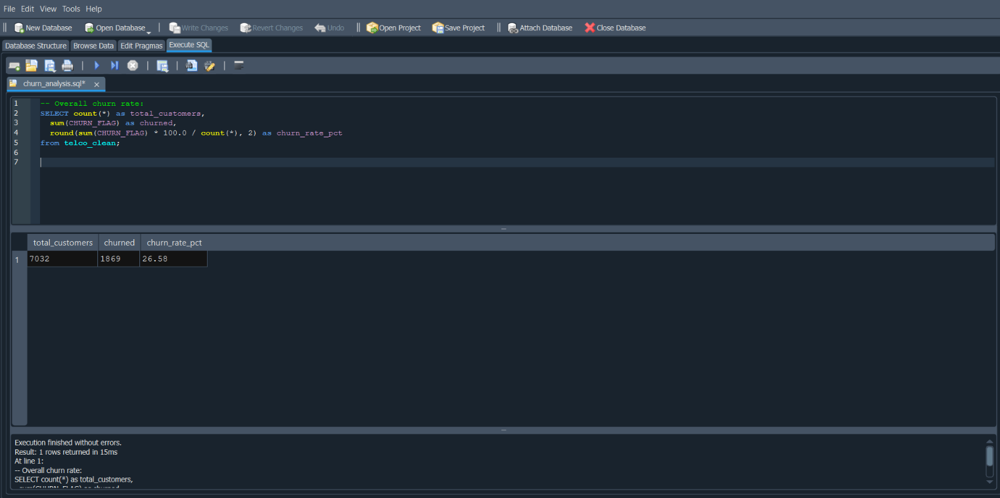
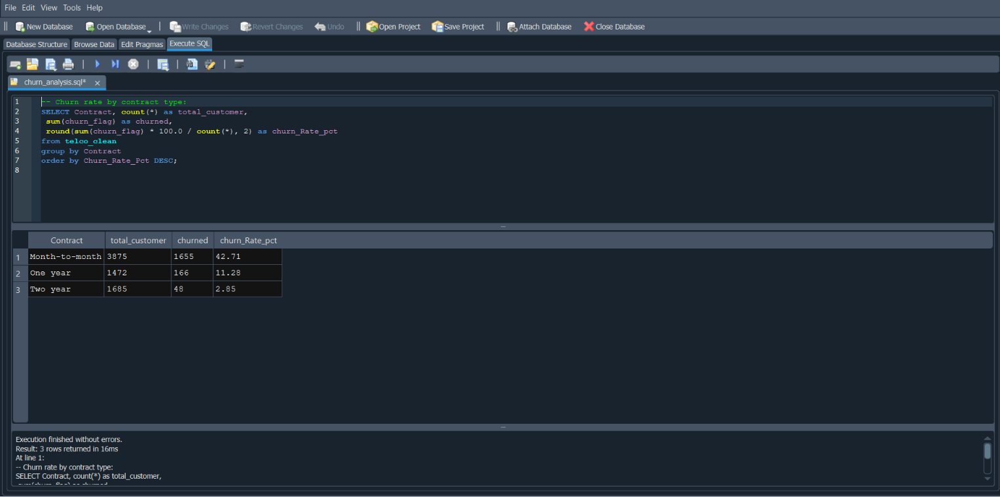
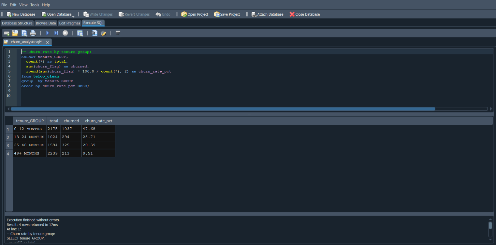
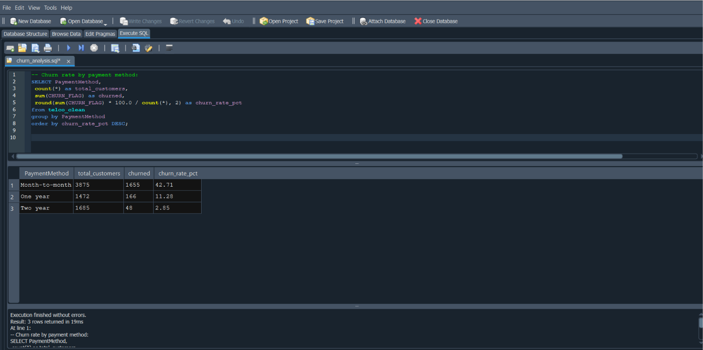
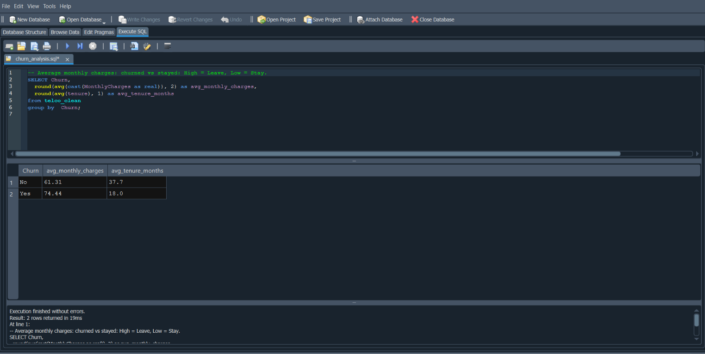
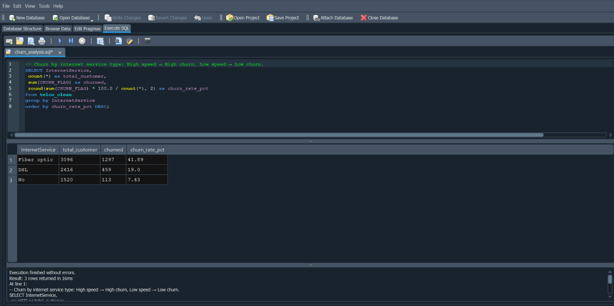
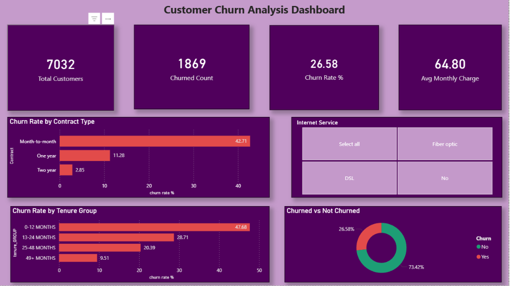
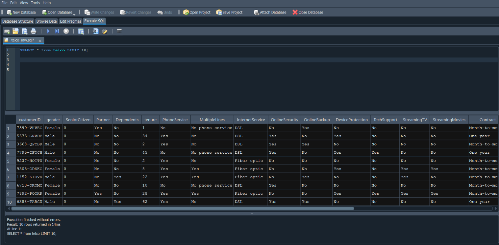
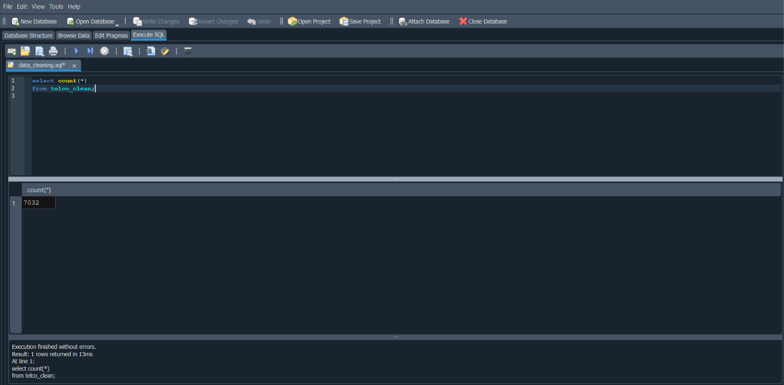

# Customer Churn Analysis
### Telco Customer Dataset | SQL · Power BI · Excel

---

## Project Overview

This project analyzes customer churn in a telecom company using SQL for data cleaning and analysis, and Power BI for dashboard visualization. The goal is to identify why customers leave and which customer segments are at highest risk of churning. The dataset contains 7,043 customer records with details on contract type, tenure, payment method, internet service, and monthly charges.

---

## Tools Used

| Tool | Purpose |
|------|---------|
| SQL (SQLite) | Data cleaning, transformation, churn analysis queries |
| DB Browser for SQLite | Query execution and CSV export |
| Power BI Desktop | Interactive churn dashboard and visualizations |
| Excel | Data validation and export review |
| GitHub | Version control and project showcase |

---

## Dataset

- **Source:** [Kaggle — Telco Customer Churn Dataset](https://www.kaggle.com/datasets/blastchar/telco-customer-churn)
- **File:** `WA_Fn-UseC_-Telco-Customer-Churn.csv`
- **Rows:** 7,043 customers (raw)
- **Columns:** 21 — including CustomerID, tenure, Contract, PaymentMethod, MonthlyCharges, TotalCharges, InternetService, Churn

---

## Problems Found in Raw Data

| Issue | Details | Action Taken |
|-------|---------|--------------|
| Blank TotalCharges | 11 rows had blank spaces instead of NULL | Removed using `WHERE TotalCharges != ' '` |
| Whitespace in text columns | Leading/trailing spaces in Contract, PaymentMethod, Churn | Cleaned using `TRIM()` |
| No numeric churn column | Churn column had Yes/No text only | Added `Churn_Flag` column (1 = churned, 0 = stayed) |
| No tenure grouping | Raw tenure was in months — hard to analyze | Added `Tenure_Group` column with 4 bands |

---

## Data Cleaning Steps

All queries are saved in [`data_cleaning.sql`](data_cleaning.sql)

```sql
-- Step 1: Remove rows with blank TotalCharges
CREATE TABLE telco_clean AS
SELECT * FROM telco
WHERE TotalCharges != ' ';

-- Step 2: Trim whitespace from key text columns
UPDATE telco_clean
SET
  Contract        = TRIM(Contract),
  PaymentMethod   = TRIM(PaymentMethod),
  InternetService = TRIM(InternetService),
  Churn           = TRIM(Churn);

-- Step 3: Add numeric churn flag
ALTER TABLE telco_clean ADD COLUMN Churn_Flag INTEGER;
UPDATE telco_clean
SET Churn_Flag = CASE WHEN Churn = 'Yes' THEN 1 ELSE 0 END;

-- Step 4: Add tenure group category
ALTER TABLE telco_clean ADD COLUMN Tenure_Group TEXT;
UPDATE telco_clean
SET Tenure_Group = CASE
  WHEN tenure <= 12 THEN '0-12 Months'
  WHEN tenure <= 24 THEN '13-24 Months'
  WHEN tenure <= 48 THEN '25-48 Months'
  ELSE                   '49+ Months'
END;
```

**Before cleaning:** 7,043 rows  
**After cleaning:** 7,032 rows (11 blank TotalCharges rows removed)

---

## Before vs After

| | Raw Data | Clean Data |
|-|----------|------------|
| Total rows | 7,043 | 7,032 |
| Blank TotalCharges | 11 rows | 0 |
| Numeric Churn column | ✗ Not present | ✓ Churn_Flag added |
| Tenure grouping | ✗ Not present | ✓ Tenure_Group added |

---

## Analysis Queries

All 6 queries are saved in [`churn_analysis.sql`](churn_analysis.sql)

### Query 1 — Overall Churn Rate
```sql
SELECT
  COUNT(*)                                       AS Total_Customers,
  SUM(Churn_Flag)                                AS Churned,
  ROUND(SUM(Churn_Flag) * 100.0 / COUNT(*), 2)  AS Churn_Rate_Pct
FROM telco_clean;
```


---

### Query 2 — Churn Rate by Contract Type
```sql
SELECT
  Contract,
  COUNT(*)                                       AS Total,
  SUM(Churn_Flag)                                AS Churned,
  ROUND(SUM(Churn_Flag) * 100.0 / COUNT(*), 2)  AS Churn_Rate_Pct
FROM telco_clean
GROUP BY Contract
ORDER BY Churn_Rate_Pct DESC;
```


---

### Query 3 — Churn Rate by Tenure Group
```sql
SELECT
  Tenure_Group,
  COUNT(*)                                       AS Total,
  SUM(Churn_Flag)                                AS Churned,
  ROUND(SUM(Churn_Flag) * 100.0 / COUNT(*), 2)  AS Churn_Rate_Pct
FROM telco_clean
GROUP BY Tenure_Group
ORDER BY Churn_Rate_Pct DESC;
```


---

### Query 4 — Churn Rate by Payment Method
```sql
SELECT
  PaymentMethod,
  COUNT(*)                                       AS Total,
  SUM(Churn_Flag)                                AS Churned,
  ROUND(SUM(Churn_Flag) * 100.0 / COUNT(*), 2)  AS Churn_Rate_Pct
FROM telco_clean
GROUP BY PaymentMethod
ORDER BY Churn_Rate_Pct DESC;
```


---

### Query 5 — Avg Charges: Churned vs Stayed
```sql
SELECT
  Churn,
  ROUND(AVG(CAST(MonthlyCharges AS REAL)), 2)   AS Avg_Monthly_Charges,
  ROUND(AVG(tenure), 1)                         AS Avg_Tenure_Months
FROM telco_clean
GROUP BY Churn;
```


---

### Query 6 — Churn Rate by Internet Service
```sql
SELECT
  InternetService,
  COUNT(*)                                       AS Total,
  SUM(Churn_Flag)                                AS Churned,
  ROUND(SUM(Churn_Flag) * 100.0 / COUNT(*), 2)  AS Churn_Rate_Pct
FROM telco_clean
GROUP BY InternetService
ORDER BY Churn_Rate_Pct DESC;
```


---

## Power BI Dashboard

Built using `telco_cleaned.csv` exported from DB Browser for SQLite.

### DAX Measures Used
```dax
Total Customers = COUNTROWS(telco_cleaned)

Total Churned = SUM(telco_cleaned[Churn_Flag])

Churn Rate % =
DIVIDE(
    SUM(telco_cleaned[Churn_Flag]),
    COUNTROWS(telco_cleaned),
    0
) * 100

Avg Monthly Charges = AVERAGE(telco_cleaned[MonthlyCharges])
```

### Dashboard Visuals
| Visual | Description |
|--------|-------------|
| 4 KPI Cards | Total Customers · Churned Count · Churn Rate % · Avg Monthly Charge |
| Bar Chart | Churn rate by Contract Type |
| Donut Chart | Churned vs Not Churned proportion |
| Clustered Bar Chart | Churn rate by Tenure Group |
| Slicer | Filter all visuals by Internet Service type |

### Full Dashboard


---

## Key Insights

1. **Month-to-month contracts have the highest churn at ~42.7%** compared to just 2.8% for two-year contracts — customers without long-term commitment leave far more easily.

2. **New customers (0–12 months) churn the most** — the first year is the highest risk window. After 48 months, churn drops to under 10%, showing loyalty builds over time.

3. **Electronic check users churn significantly more** than customers paying by credit card or bank transfer — pointing to a link between payment friction and dissatisfaction.

4. **Churned customers pay higher monthly charges** on average than customers who stayed — price sensitivity is a key churn driver in this dataset.

5. **Fiber optic internet users churn more than DSL users** despite being a premium product — suggesting service quality or value perception issues with that segment.

6. **Overall churn rate is ~26.5%** — meaning roughly 1 in 4 customers leaves, which is high for a telecom and highlights the need for proactive retention strategies.

---

## Screenshots

### Raw Data (Before Cleaning)


### Row Count: Before vs After


### Analysis Query Results


### Power BI Dashboard


---

## Repository Structure

```
customer-churn-analysis/
│
├── README.md                  ← You are here
├── data_cleaning.sql          ← Cleaning queries with comments
├── churn_analysis.sql         ← 6 analysis queries
├── telco_cleaned.csv          ← Final clean dataset
├── churn_dashboard.pbix       ← Power BI dashboard file
│
└── screenshots/
    ├── raw_data_preview.png
    ├── row_count_comparison.png
    ├── query1_overall_churn.png
    ├── query2_contract_churn.png
    ├── query3_tenure_churn.png
    ├── query4_payment_churn.png
    ├── query5_charges_comparison.png
    ├── query6_internet_churn.png
    └── dashboard_full.png
```

---

## Skills Demonstrated

- Data profiling and quality assessment
- Handling blank string values (non-NULL blanks)
- Derived column creation — binary flag and grouped categories
- Churn rate calculation using SQL aggregation
- Segmentation analysis by contract, tenure, payment, and service type
- DAX measure creation in Power BI
- Interactive dashboard design with slicers and KPI cards
- Business insight generation from customer behavior data

---

## Connect

**LinkedIn:** _(https://www.linkedin.com/in/ahamed-shajith-28016932b/)_  
**GitHub:** _(https://github.com/Ahamedshajith07)_

---

*Dataset source: Kaggle — Telco Customer Churn | Tools: DB Browser for SQLite · Power BI Desktop*
